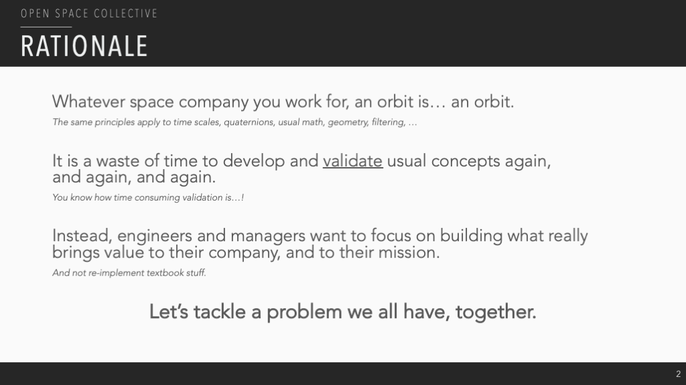
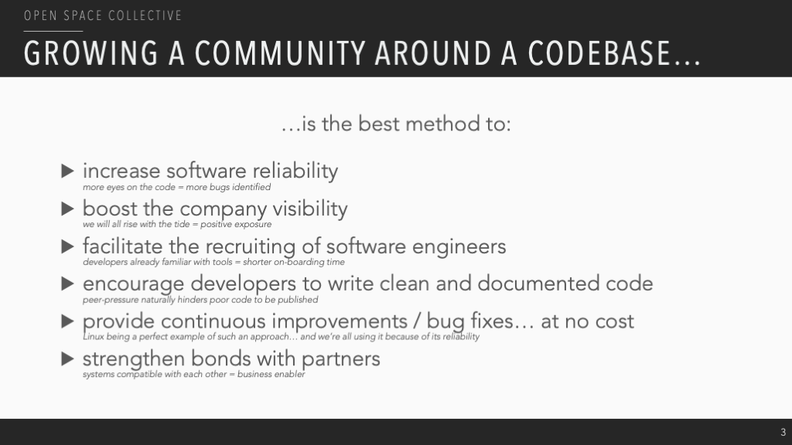

# Open Space Toolkit

[](https://opensource.org/licenses/Apache-2.0)

The Open Space Toolkit (**OSTk**) is a collection of generic libraries for aerospace engineering use, currently available in C++ and in Python.

- C++ – reference implementation, for portability and performance.
- Python – via C++ bindings, formidable for interactive use and prototyping.

## Warning

*⚠ Still under development.*

## Getting Started

Want to quickly get started? It's pretty simple.

Install [Docker](**https**://www.docker.com/) and try this:

```bash
docker run -it openspacecollective/open-space-toolkit-astrodynamics-python
```

This will start an [iPython](https://ipython.org/) shell within a container where all OSTk components are already installed.

Once the shell is up and running, playing with OSTk is easy:

```py
from ostk.physics import Environment # Environment modeling class
from ostk.physics.time import Instant # Instant class
from ostk.physics.coordinate import Frame # Reference frame class

environment = Environment.default() # Bootstrap a default environment

moon = environment.access_object_with_name('Moon') # Access Moon

environment.set_instant(Instant.now()) # Set environment to present time

moon.get_position_in(Frame.ITRF()) # Position of the Moon in ITRF
moon.get_axes_in(Frame.ITRF()) # Axes of the Moon in ITRF
```

By default, OSTk fetches the ephemeris from JPL, Earth Orientation Parameters (EOP) and leap second count from IERS.

As a result, when running OSTk for the first time, it may take a minute to fetch all the necessary data.

*Tip: Use tab for auto-completion!*

## Rationale





## Components

| Name                                                                                       | Description                                                   | Version                                                                                                                                                                                      |
| ------------------------------------------------------------------------------------------ | ------------------------------------------------------------- | -------------------------------------------------------------------------------------------------------------------------------------------------------------------------------------------- |
| [Core](https://github.com/open-space-collective/open-space-toolkit-core)                   | Fundamental types, containers and utilities.                  | [](https://badge.fury.io/gh/open-space-collective%2Fopen-space-toolkit-core)                   |
| [I/O](https://github.com/open-space-collective/open-space-toolkit-io)                      | Addressing, networking, database connectors.                  | [](https://badge.fury.io/gh/open-space-collective%2Fopen-space-toolkit-io)                       |
| [Mathematics](https://github.com/open-space-collective/open-space-toolkit-mathematics)     | Geometry, curve fitting, optimization.                        | [](https://badge.fury.io/gh/open-space-collective%2Fopen-space-toolkit-mathematics)     |
| [Physics](https://github.com/open-space-collective/open-space-toolkit-physics)             | Physical units, time, reference frames, environment modeling. | [](https://badge.fury.io/gh/open-space-collective%2Fopen-space-toolkit-physics)             |
| [Astrodynamics](https://github.com/open-space-collective/open-space-toolkit-astrodynamics) | Orbit, attitude, access.                                      | [](https://badge.fury.io/gh/open-space-collective%2Fopen-space-toolkit-astrodynamics) |

## Use Cases

Check out some use-cases [here](./docs/Use%20Cases.md)!

## FAQ

*To be completed...*

## Contributing

Contributions are more than welcome!

Please read our [contributing guide](CONTRIBUTING.md) to learn about our development process, how to propose bugfixes and improvements, and how to build and test the code.

## Code of Conduct

*To be completed...*

## Special Thanks

*To be completed...*

## License

Apache License 2.0
